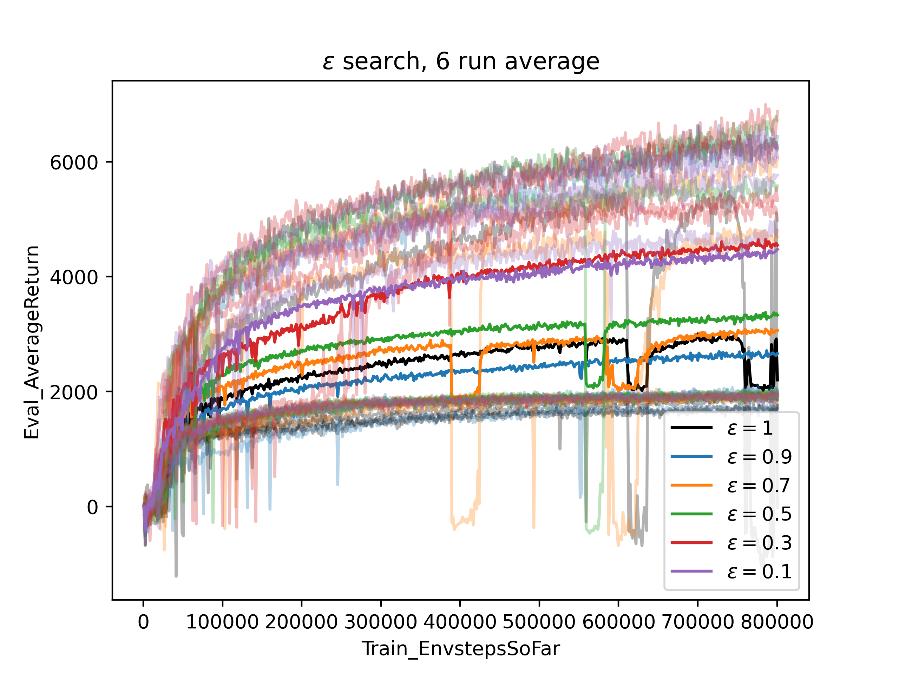

# Project Notes

### Update 2022-12-29
#### Here's a list of changes made to the code since the first draft of the report:
- Fixed a **target update frequency bug**. Target networks were updated agent_num times more frequent. Now the update frequency is as specified by `critic_target_update_frequency`
- Fixed a **target network advice sourse bug**. Now target networks get advice from other target networks instead of from critic networks when training. 
- Changed advice behavior. We are now using advice as **context** to the observations, meaning that every where we have observatin we have advice with probability $1 - \epsilon$. This includes when actor calls critic and when calculating target q values using the target critic networks. 
- Added **self_advice option** for better symmetry. When self advicing, the advice is generated the network under-training it self. 
- Reduced mini-batch size from 1500 to 256 for consistancy with the [original paper](https://arxiv.org/pdf/1801.01290.pdf)
- Finished a **larger scale experiment** with the aforementioned changes. Ran for 1000 timesteps per episode, recorded results for $\epsilon \in \{1, 0.9, 0.7, 0.5, 0.3, 0.1\}$, and averaged over 6 runs. 

#### Todo:
- Change location of choosing random peer. Choose random peer inside agent train function. 
- Find a way to fix the target network. It's not supposed to change until we soft-update it. Right now, every time a peer gets advice from a target network, gradients are backpropagated through the target network and it changes.
- Find a way to add **positional encoding** in the advice which help the critic identify which agent the advice comes from. 
- Investigate multi-task RL/ML structures in the critic. It needs to estimate q-values (task 1) and give advice (task 2).
- **Investigate why our SAC implementation is not performing as well as in the papers here: https://arxiv.org/pdf/1802.09477.pdf and here https://arxiv.org/pdf/1801.01290.pdf**. Also Think about the **bimodal behavior** seen in the experimental results. 
- **Clearn up** repo. Cluster .sh, .png files
- Update report with the changes. 

#### Wishlist
- Figure out video generation
- Think about ways to visualize the advices being generated

